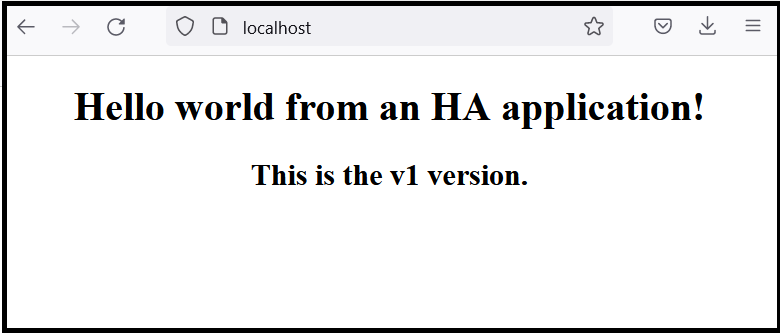
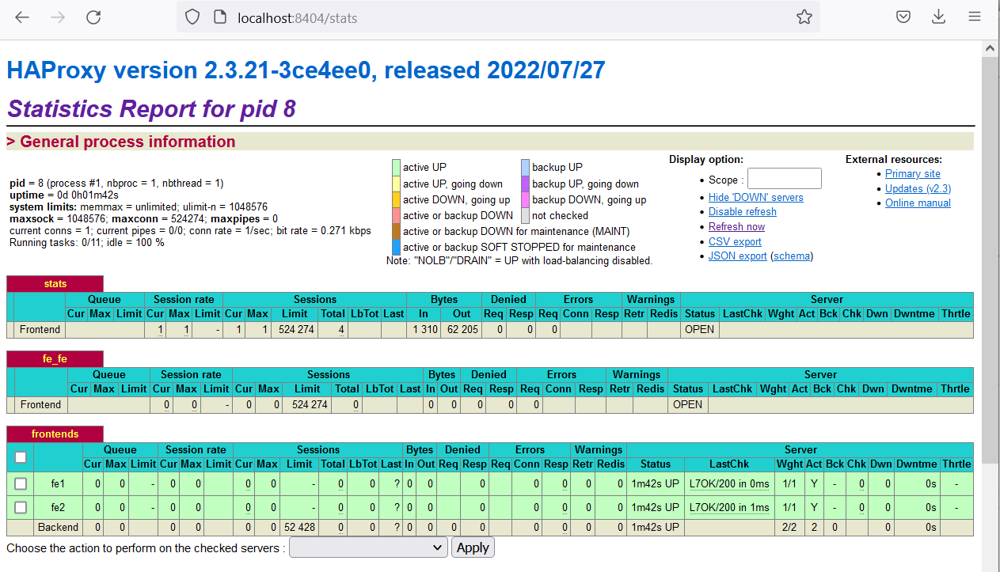

# HA Example

I seguenti comandi vanno eseguiti su una macchina dotata dei seguenti prerequisiti:

* docker
* docker compose

Devono essere eseguiti con l'utenza di massimo privilegio (root). In caso contrario va anteposto il comando `sudo` ad ognuno dei comandi.

## Avvio del servizio ad istanza singola (no HA)

Cloniamo il presente repository.

```
git clone https://github.com/supix/ha_example
```

Portiamoci nella cartella del frontend.

```
cd ha_example/frontend
```

Generiamo la versione `v1` dell'immagine del frontend, basata sull'immagine di nginx, attraverso il docker file `Dockerfile_v1`.

```
docker build -t frontend:v1 -f Dockerfile_v1 .
```

L'output del comando è simile al seguente.

```
Sending build context to Docker daemon   5.12kB
Step 1/2 : from nginx
latest: Pulling from library/nginx
025c56f98b67: Pull complete
ca9c7f45d396: Pull complete
ed6bd111fc08: Pull complete
e25b13a5f70d: Pull complete
9bbabac55ab6: Pull complete
e5c9ba265ded: Pull complete
Digest: sha256:ab589a3c466e347b1c0573be23356676df90cd7ce2dbf6ec332a5f0a8b5e59db
Status: Downloaded newer image for nginx:latest
 ---> ac8efec875ce
Step 2/2 : COPY index_v1.html /usr/share/nginx/html/index.html
 ---> 6dd8b77e3d32
Successfully built 6dd8b77e3d32
Successfully tagged frontend:v1
```

Nel repository docker locale è presente l'immagine appena creata.

```
root@ubuntu:~/ha_example/frontend# docker image ls
REPOSITORY   TAG       IMAGE ID       CREATED         SIZE
frontend     v1        6dd8b77e3d32   14 seconds ago  142MB
nginx        latest    ac8efec875ce   4 days ago      142MB
```

Avviamo un'istanza del container a partire dall'immagine `frontend:v1`.

```
docker run -d --name fe -p 80:80 frontend:v1
```

Verifichiamo che l'istanza sia correttamente attiva.

```
docker ps
```

L'output sarà simile al seguente.

```
CONTAINER ID   IMAGE         COMMAND                  CREATED         STATUS         PORTS                               NAMES
7af049f01674   frontend:v1   "/docker-entrypoint.…"   5 minutes ago   Up 5 minutes   0.0.0.0:80->80/tcp, :::80->80/tcp   fe
```

Nel comando precedente è stata specificata l'opzione `-p 80:80`. Questa opzione fa sì che la porta `80` del container venga rimappata sulla porta `80` dell'host docker, con la possibilità di accedere direttamente al web server, digitando il seguente comando.

```
curl localhost
```

L'output è simile al seguente.

```
<html>
        <head><title>My HA app</title></head>
        <body>
                <center>
                        <h1>Hello world from an HA application!</h1>
                        <h2>This is the v1 version.</h2>
                <center>
        </body>
</html>
```

Se l'host docker è una macchina virtuale, è possibile mappare ulteriormente la porta `80` sull'host che ospita la macchina virtuale, con la possibilità di accedere al contenuto web direttamente da un web browser, digitando nella barra degli indirizzi l'URL `http://localhost`.



Proviamo ora a generare una seconda immagine aggiornata del container di frontend, che chiameremo `frontend:v2`. Analogamente a quanto fatto prima, digitiamo il seguente comando.

```
docker build -t frontend:v2 -f Dockerfile_v2 .
```

Ora nel repository docker locale sono presenti le immagini `v1` e `v2` del frontend.

```
root@ubuntu:~/ha_example/frontend# docker image ls
REPOSITORY   TAG       IMAGE ID       CREATED         SIZE
frontend     v2        f419d9150a57   8 seconds ago   142MB
frontend     v1        6dd8b77e3d32   3 hours ago     142MB
nginx        latest    ac8efec875ce   4 days ago      142MB
```

Per simulare un aggiornamento applicativo, dobbiamo fermare il container in versione `v1` ed avviare quello in versione `v2`.

Fermiamo il container in versione `v1`.

```
docker rm -f fe
```

In questo momento il comando `docker ps` indica che non vi sono containers attivi.

```
root@ubuntu:~/ha_example/frontend# docker ps
CONTAINER ID   IMAGE     COMMAND   CREATED   STATUS    PORTS     NAMES
```

Provando ad accedere alla pagina web si ottiene un errore di irraggiungibilità del web server.

```
root@ubuntu:~/ha_example/frontend# curl localhost
curl: (7) Failed to connect to localhost port 80 after 0 ms: Connection refused
```

Avviamo la versione `v2` del container.

```
docker run -d --name fe -p 80:80 frontend:v2
```

Riproviamo ad accedere al contenuto web.

```
root@ubuntu:~/ha_example/frontend# curl localhost
<html>
        <head><title>My HA app</title></head>
        <body>
                <center>
                        <h1>Hello world from an HA application!</h1>
                        <h2>This is the v2 version.</h2>
                <center>
        </body>
</html>
```

Come si vede è ora disponibile la versione `v2` della applicazione web.

Prima di proseguire, fermiamo l'istanza attiva del servizio.

```
docker rm -f fe
```

## Un passo verso l'HA

Avvieremo ora due istanze del frontend, che verranno bilanciate attraverso un _load balancer_ basato sull'immagine del container `haproxy:2.3`.

Creiamo l'immagine del load balancer.

```
cd ../haproxy
docker build -t lb:v1 .
```

L'elenco delle immagini disponibili localmente è il seguente.

```
root@ubuntu:~/ha_example/haproxy# docker image ls
REPOSITORY   TAG       IMAGE ID       CREATED          SIZE
lb           v1        98cc13137992   17 seconds ago   99.4MB
frontend     v2        f419d9150a57   14 minutes ago   142MB
frontend     v1        6dd8b77e3d32   3 hours ago      142MB
nginx        latest    ac8efec875ce   4 days ago       142MB
haproxy      2.3       7ecd3fda00f4   4 months ago     99.4MB
```

Notiamo che l'immagine del load balancer è stata creata utilizzando il seguente file di configurazione `haproxy.cfg`.

```
root@ubuntu:~/ha_example/haproxy# cat haproxy.cfg
defaults
  mode http
  timeout client 10s
  timeout connect 5s
  timeout server 10s
  timeout http-request 10s

frontend stats
    bind *:8404
    stats enable
    stats uri /stats
    stats refresh 10s
    stats admin if TRUE

frontend fe_fe
  bind *:80
  default_backend frontends

backend frontends
  balance roundrobin

  option httpchk
  http-check send meth GET uri /
  http-check expect status 200

  server fe1 fe1:80 check
  server fe2 fe2:80 check
```

La sezione `backend` indica che il bilanciamento va effettuato sui due containers chiamati `fe1` e `fe2`, con strategia _round robin_. Inoltre entrambi i frontend vengono periodicamente interrogati per verificarne lo stato di salute. Sulla sezione `frontend stats` torneremo tra breve.

Attiviamo ora due istanze di frontend basate sulla versione `v1` dell'immagine.

```
docker run -d --name fe1 frontend:v1
docker run -d --name fe2 frontend:v1
```

Verifichiamo che le istanze siano attive.

```
root@ubuntu:~/ha_example/haproxy# docker ps
CONTAINER ID   IMAGE         COMMAND                  CREATED         STATUS         PORTS     NAMES
a6b7833c8aeb   frontend:v1   "/docker-entrypoint.…"   3 seconds ago   Up 2 seconds   80/tcp    fe2
70e92788142d   frontend:v1   "/docker-entrypoint.…"   7 seconds ago   Up 6 seconds   80/tcp    fe1
```

Come si può notare, ora non è stata usata l'opzione `-p 80:80`. Infatti i container non devono essere esposti direttamente sulla porta `80` dell'host docker. Sarà infatti il load balancer ad essere visibile su quella porta, mediando così l'accesso ai frontend.

Per questo, l'accesso alla porta `80` dà un errore di irraggiungibilità.

```
root@ubuntu:~/ha_example/haproxy# curl localhost
curl: (7) Failed to connect to localhost port 80 after 0 ms: Connection refused
```

Proviamo ad entrare interattivamente all'interno del container `fe1`, eseguendo la shell bash.

```
root@ubuntu:~/ha_example/haproxy# docker exec -it fe1 /bin/bash
root@70e92788142d:/#
```

Da qui possiamo accedere al web server locale.

```
root@70e92788142d:/# curl localhost
<html>
        <head><title>My HA app</title></head>
        <body>
                <center>
                        <h1>Hello world from an HA application!</h1>
                        <h2>This is the v1 version.</h2>
                <center>
        </body>
</html>
```

Dall'interno del container, proviamo ad accedere al web server esposto dal container `fe2`.

```
root@70e92788142d:/# curl fe2
curl: (6) Could not resolve host: fe2
```

Usciamo dal container `fe1`.

```
root@70e92788142d:/# exit
exit
root@ubuntu:~/ha_example/haproxy#

```

L'errore ottenuto dipende dal non aver definito alcuna rete per i container creati. Pertanto ogni container è isolato da tutti gli altri. Risolviamo il problema abbattendo entrambi i containers, creando una rete e ricreando nuovamente le due istanze dei frontend agganciandoli alla rete appena creata. Ecco i comandi da eseguire.

```
docker rm -f fe1 fe2
docker network create my_net
docker run -d --name fe1 --network my_net frontend:v1
docker run -d --name fe2 --network my_net frontend:v1
```

Riproviamo ora ad accedere ai contenuti offerti da `fe2` dall'interno del container `fe1`. Poi usciamo dal container `fe1`.

```
root@ubuntu:~/ha_example/haproxy# docker exec -it fe1 /bin/bash
root@e40ec52e3f5b:/# curl fe2
<html>
        <head><title>My HA app</title></head>
        <body>
                <center>
                        <h1>Hello world from an HA application!</h1>
                        <h2>This is the v1 version.</h2>
                <center>
        </body>
</html>
root@e40ec52e3f5b:/# exit
exit
```

Come si vede ora i due container sono reciprocamente raggiungibili attraverso i loro nomi. Come si può verificare continuano comunque a restare irraggiungibili dall'host docker.

```
root@ubuntu:~/ha_example/haproxy# curl localhost
curl: (7) Failed to connect to localhost port 80 after 0 ms: Connection refused
```

Avviamo il load balancer, che è stato configurato per fare da intermediario verso i due frontends `fe1` e `fe2`.

```
docker run -d --name lb --network my_net -p 80:80 lb:v1
```

Verifichiamo che i container attivi ora sono tre.

```
root@ubuntu:~/ha_example/haproxy# docker ps
CONTAINER ID   IMAGE         COMMAND                  CREATED         STATUS         PORTS                               NAMES
8fe907c303a6   lb:v1         "docker-entrypoint.s…"   3 seconds ago   Up 2 seconds   0.0.0.0:80->80/tcp, :::80->80/tcp   lb
84de77cc656e   frontend:v1   "/docker-entrypoint.…"   4 minutes ago   Up 4 minutes   80/tcp                              fe2
e40ec52e3f5b   frontend:v1   "/docker-entrypoint.…"   4 minutes ago   Up 4 minutes   80/tcp                              fe1
```

Proviamo ora ad accedere al web server dall'host docker.

```
root@ubuntu:~/ha_example/haproxy# curl localhost
<html>
        <head><title>My HA app</title></head>
        <body>
                <center>
                        <h1>Hello world from an HA application!</h1>
                        <h2>This is the v1 version.</h2>
                <center>
        </body>
</html>
```

Come si vede, ora i contenuti sono disponibili.

## Aggiornamento applicativo senza indisponibilità del servizio

Siccome ora il servizio web è offerto da due container bilanciati, è tollerante alla caduta di uno dei due container. Possiamo quindi simulare un aggiornamento applicativo.

Fermiamo il container `fe1`.

```
docker rm -f fe1
```

Nonostante uno dei container sia caduto, il contenuto web è ancora disponibile. Proviamo ad accedervi.

```
root@ubuntu:~/ha_example/haproxy# curl localhost
<html>
        <head><title>My HA app</title></head>
        <body>
                <center>
                        <h1>Hello world from an HA application!</h1>
                        <h2>This is the v1 version.</h2>
                <center>
        </body>
</html>
```

Creiamo di nuovo l'istanza del container `fe1` ma questa volta utilizzando la versione `v2` dell'immagine.

```
docker run -d --name fe1 --network my_net frontend:v2
```

Proviamo ora ad accedere più volte al contenuto web.

```
root@ubuntu:~/ha_example/haproxy# curl localhost
<html>
        <head><title>My HA app</title></head>
        <body>
                <center>
                        <h1>Hello world from an HA application!</h1>
                        <h2>This is the v1 version.</h2>
                <center>
        </body>
</html>
root@ubuntu:~/ha_example/haproxy# curl localhost
<html>
        <head><title>My HA app</title></head>
        <body>
                <center>
                        <h1>Hello world from an HA application!</h1>
                        <h2>This is the v2 version.</h2>
                <center>
        </body>
</html>
root@ubuntu:~/ha_example/haproxy# curl localhost
<html>
        <head><title>My HA app</title></head>
        <body>
                <center>
                        <h1>Hello world from an HA application!</h1>
                        <h2>This is the v1 version.</h2>
                <center>
        </body>
</html>
root@ubuntu:~/ha_example/haproxy# curl localhost
<html>
        <head><title>My HA app</title></head>
        <body>
                <center>
                        <h1>Hello world from an HA application!</h1>
                        <h2>This is the v2 version.</h2>
                <center>
        </body>
</html>
```

Come si nota, il contenuto web viene servito alternativamente dal container in versione `v1` e da quello in versione `v2`, perché ora i container attivi sono nuovamente due e la strategia di bilanciamento offerta dal load balancer è di tipo round robin.

A questo punto possiamo aggiornare alla versione `v2` anche il container `fe2`.

```
docker rm -f fe2
docker run -d --name fe2 --network my_net frontend:v2
```

Durante questa operazione il container `fe1` continuerà ad offrire il servizio e non vi sarà indisponibilità. Dopo l'esecuzione dei comandi, il load balancer bilancia tra due container in versione `v2`.

```
root@ubuntu:~/ha_example/haproxy# docker ps
CONTAINER ID   IMAGE         COMMAND                  CREATED              STATUS              PORTS                               NAMES
0f551f544300   frontend:v2   "/docker-entrypoint.…"   About a minute ago   Up About a minute   80/tcp                              fe2
e2583cc9d162   frontend:v2   "/docker-entrypoint.…"   4 minutes ago        Up 4 minutes        80/tcp                              fe1
8fe907c303a6   lb:v1         "docker-entrypoint.s…"   12 minutes ago       Up 12 minutes       0.0.0.0:80->80/tcp, :::80->80/tcp   lb
```

La sezione `frontend stats` del file `haproxy.cfg` espone un cruscotto di monitoraggio utile a visualizzare lo stato del cluster applicativo. Per raggiungerla con un browser è necessario mappare la porta `8404` sull'host docker ed, eventualmente, sull'host che ospita la macchina virtuale docker.

```
docker rm -f lb
docker run -d --name lb --network my_net -p 80:80 -p 8404:8404 lb:v1
```

Puntando con il browser all'indirizzo `http://localhost:8404/stats` si visualizza il cruscotto di monitoraggio.



## La creazione automatica del setup applicativo: docker compose

Analizziamo il file `docker.compose.yml` presente nel repository.

```
version: "3.9"
services:
  fe1:
    image: frontend:v1
    container_name: fe1
    restart: unless-stopped
  fe2:
    image: frontend:v1
    container_name: fe2
    restart: unless-stopped
  lb:
    image: lb:v1
    container_name: lb
    ports:
      - "80:80"
      - "8404:8404"
    depends_on:
      - fe1
      - fe2
    restart: unless-stopped
```

Si può notare come questo file descriva il setup precedentemente allestito mediante l'esecuzione di molteplici comandi di tipo `docker run`.

Grazie a questa descrizione, l'intero servizio può essere attivato con un unico comando.

```
root@ubuntu:~/ha_example# docker compose up -d
[+] Running 4/4
 ⠿ Network ha_example_default  Created                                                                                                      0.1s
 ⠿ Container fe1               Started                                                                                                      1.2s
 ⠿ Container fe2               Started                                                                                                      1.3s
 ⠿ Container lb                Started                                                                                                      1.7s
```

Dopo l'esecuzione del comando, digitando `docker ps` si vede come i tre containers sono tutti attivi e correttamente collegati alle porte 80 e 8404 dell'host docker.

```
root@ubuntu:~/ha_example# docker ps
CONTAINER ID   IMAGE         COMMAND                  CREATED              STATUS              PORTS                                                                          NAMES
038fe59dcd93   lb:v1         "docker-entrypoint.s…"   About a minute ago   Up About a minute   0.0.0.0:80->80/tcp, :::80->80/tcp, 0.0.0.0:8404->8404/tcp, :::8404->8404/tcp   lb
39343a9e1da3   frontend:v1   "/docker-entrypoint.…"   About a minute ago   Up About a minute   80/tcp                                                                         fe1
e0b95aeafc37   frontend:v1   "/docker-entrypoint.…"   About a minute ago   Up About a minute   80/tcp                                                                         fe2
```

Inoltre, l'esecuzione ha anche automaticamente creato la rete `ha_example_default` al quale sono agganciati tutti i container.

Le righe `restart: unless-stopped` nel file fanno sì che tutto il servizio venga automaticamente riavviato anche nel caso in cui l'host docker venga riavviato. Si può provare ad eseguire un comando `reboot` sull'host docker per verificare che, una volta riavviato, i tre container sono di nuovo attivi.

Anche per abbattere completamente il servizio erogato dai tre container è sufficiente un solo comando: `docker compose down`.

```
root@ubuntu:~/ha_example# docker compose down
[+] Running 4/3
 ⠿ Container lb                Removed                                                                                                      0.2s
 ⠿ Container fe2               Removed                                                                                                      0.4s
 ⠿ Container fe1               Removed                                                                                                      0.4s
 ⠿ Network ha_example_default  Removed                                                                                                      0.1s
root@ubuntu:~/ha_example# docker ps
CONTAINER ID   IMAGE     COMMAND   CREATED   STATUS    PORTS     NAMES
```